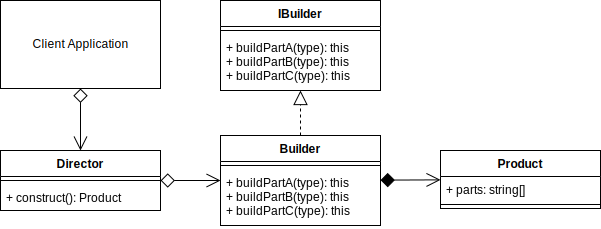

# PATRON BUILDER 

El patron builder es un patron creacional cuyo objetivo es separar la logica de construccion de un objeto complejo de su representacion.
Este patron permite que se creen objetos complejos con diferente representacion en tiempo de ejecucion

## Que intenta resolver ? 
+ como crear representaciones diferentes de objeto complejo
+ como simplificar una clase que incluye la construccion de un objeto complejo

## TERMINOLOGY

+ **Producto:** Producto complejo que se esta construyendo
+ **Interfaz de constructor:** Interfaz que debe implementar la clase constructora
+ **Constructor:** proporciona los metodos y recupera el objeto en concreto
+ **Director:** Tiene un metodo Construct() que cuando se llama crea un producto personalizado usando los metodos definidos en constructor



### SOURCES

> [READ MORE ABOUT FACTORY PATTERN](https://sbcode.net/typescript/builder/).
> 
> [WATCH ABOUT FACTORY PATTERN](https://www.youtube.com/watch?v=qkjRQQxgbtQ&ab_channel=nicosiored)

-------

## SUPERCLASS'S INTERFACE

```typescript
interface ModelCreate<TModel>{
    buildCreate(): TModelDTO
}

interface ModelUpdate<TModel>{
    buildUpdate(): TModelDTO
}

interface ModelGet<TModel>{
    buildGet(): TModelDTO
}

interface ModelDelete<TModel>{
    buildDelete(): TModelDTO
}

```


